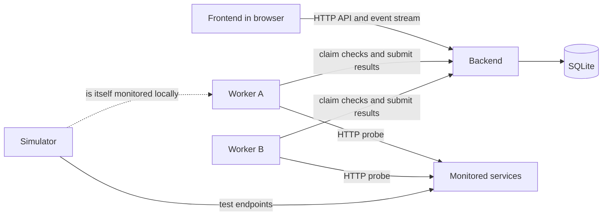

# Sentinel Architecture

## Purpose

Sentinel is a distributed reliability monitoring platform for defining service checks, running those checks from one or more workers, and viewing current and historical health. The first implementation should be intentionally small, run entirely on one developer machine, and require no paid services or cloud accounts.

The initial system is a modular monolith with separate processes at its edges:

For local development, the simulator is a monitored target: workers probe its endpoints and report results to the backend. Additional workers can be started to exercise distributed behavior without introducing a message broker.

## Design principles

- **Local and free:** use open-source dependencies, SQLite, local processes, and optionally Docker Compose. No hosted database, queue, telemetry vendor, or paid API is required.
- **One source of truth:** the backend is the only component that reads or writes the database.
- **Simple distribution:** workers communicate with the backend over HTTP. They do not share a filesystem or database connection.
- **Clear boundaries:** checking targets belongs to workers; storing and interpreting results belongs to the backend; presentation belongs to the frontend.
- **Incremental growth:** begin with HTTP checks and polling. Add infrastructure only when measured scale or reliability needs justify it.

## Repository responsibilities

### `backend/`

The backend is the control plane and system of record. It should:

- expose an HTTP API for check configuration, worker coordination, result ingestion, and dashboard queries;
- validate inputs and apply authentication when that is introduced;
- schedule due checks by making work available for workers to claim;
- calculate service state from recent observations;
- store checks, worker registrations, observations, incidents, and configuration in SQLite;
- expose a lightweight event stream, such as Server-Sent Events, if live dashboard updates are needed.

The backend should not perform network probes itself. Keeping execution in workers makes it possible to monitor from different locations without changing the control plane.

### `frontend/`

The frontend is the browser-based operator interface. It should:

- show monitored services, current status, latency, recent failures, and worker health;
- provide forms for creating, editing, pausing, and deleting checks;
- display observation history and incident timelines;
- consume only the backend API and never access the database directly.

The first version can be a small single-page application served by its development server. A production-style local build may be served as static files by the backend or a free local web server.

### `simulator/`

The simulator provides deterministic targets for development, demonstrations, and tests. It should offer endpoints that can be configured to:

- return healthy or failing HTTP status codes;
- respond immediately or after a delay;
- fail intermittently using a repeatable pattern;
- recover on demand.

It is not part of Sentinel's control plane and should contain no monitoring logic. Its purpose is to reproduce target behavior without depending on the public internet or third-party services.

### `workers/`

Workers are the distributed data plane. Each worker should:

- register itself and periodically send a heartbeat to the backend;
- poll the backend for due work and claim checks with a short lease;
- execute HTTP probes with strict timeouts and bounded response sizes;
- submit normalized results including timing, outcome, error category, and worker identity;
- retry result delivery conservatively and tolerate temporary backend unavailability.

Workers should be stateless apart from ephemeral in-flight work. Running multiple worker processes should be enough to demonstrate distribution. Leases and idempotent result identifiers prevent duplicate execution or ingestion from corrupting state.

### `tests/`

The top-level test directory contains cross-component and end-to-end coverage. It should:

- start the backend, one or more workers, and the simulator in an isolated environment;
- verify the full path from check creation through probe execution to dashboard data;
- cover leases, duplicate result submission, worker loss, timeouts, failures, and recovery;
- keep fixtures deterministic and avoid external network access.

Unit and component-specific tests may live beside their implementation, while shared integration fixtures and full-system scenarios belong here.

### `docs/`

Documentation records decisions and operating knowledge. It should contain:

- this architecture and its evolution;
- API contracts and data model notes;
- architecture decision records for significant tradeoffs;
- local setup, development, testing, and troubleshooting instructions;
- operational guidance such as backup, restore, and incident-state semantics.

Documentation should describe implemented behavior. Proposed changes should be clearly labeled until they exist.

## Initial component interactions

1. An operator creates an HTTP check through the frontend and backend API.
2. The backend stores the check and determines when it is due.
3. A worker polls for work and receives a time-limited lease for the check.
4. The worker probes the target, which can be the local simulator during development.
5. The worker sends an observation to the backend using a unique result identifier.
6. The backend stores the observation, updates derived service and incident state, and returns the new state to the frontend.

Polling and leases keep the first version understandable and remove the need for Redis, Kafka, or another broker. SQLite is appropriate for local development because only the backend owns it. The storage layer and work-claiming contract should remain explicit so a server database or queue can be adopted later without changing workers or the frontend wholesale.

## Minimal data model

The first useful model needs only a few concepts:

- **Check:** target URL, interval, timeout, expected status, enabled state, and timestamps.
- **Worker:** stable identifier, display name, capabilities, and last heartbeat.
- **Lease:** check, worker, lease expiration, and attempt identifier.
- **Observation:** unique result identifier, check, worker, start time, duration, outcome, status code, and error category.
- **Incident:** check, opening and closing observations, start and end times, and current state.

Service status and summary metrics should be derived from observations initially. Precomputed aggregates can wait until real data volume makes them necessary.

## Local runtime

The complete development environment should support two equivalent paths:

- run each process directly with language package managers and a repository-local SQLite file;
- run the same processes with Docker Compose, using only local images and volumes after dependencies are downloaded.

Useful defaults should require no secrets. Bind services to localhost, use unprivileged ports, and keep generated databases and build artifacts out of version control. Tests should use temporary databases and dynamically assigned ports so parallel runs do not conflict.

## Phased implementation plan

### Phase 0: Contracts and project foundations

- Choose the backend/worker language and frontend framework.
- Define API request and response shapes, status semantics, and the initial SQLite schema.
- Add configuration loading, formatting, linting, and test commands for each component.
- Document a one-command local startup path without adding external infrastructure.

**Exit criterion:** empty services can start locally, report readiness, and be tested, with their interfaces documented.

### Phase 1: Vertical monitoring slice

- Implement check CRUD and SQLite persistence in the backend.
- Implement worker registration, polling, leases, HTTP probing, and result ingestion.
- Add simulator endpoints for healthy, failing, and delayed responses.
- Build a minimal frontend showing checks and their latest observations.
- Add one end-to-end test covering creation, execution, ingestion, and display data.

**Exit criterion:** a local worker repeatedly monitors the simulator and the latest state is visible through the UI.

### Phase 2: Reliability behavior

- Make claims and result ingestion idempotent.
- Add heartbeats, expired-lease recovery, bounded retries, and graceful shutdown.
- Define state transitions and open or close incidents from consecutive observations.
- Cover worker loss, duplicate submissions, timeout handling, intermittent failures, and recovery.

**Exit criterion:** multiple workers can run concurrently without losing work or corrupting state, and failures produce deterministic incidents.

### Phase 3: Operator experience

- Add check editing, pausing, validation, filtering, and clear empty/error states.
- Add latency history, observation details, incident timelines, and worker status.
- Add live updates with Server-Sent Events only if ordinary refresh is insufficient.
- Complete local setup, troubleshooting, backup, and restore documentation.

**Exit criterion:** a developer can install, operate, diagnose, and reset Sentinel locally using documented commands.

### Phase 4: Hardening and scale validation

- Add retention and cleanup policies, pagination, indexes, and basic health metrics.
- Load-test the API, scheduler, and database to establish actual limits.
- Add authentication and authorization before exposing Sentinel beyond a trusted local network.
- Consider PostgreSQL or a broker only if measurements show SQLite or polling is the bottleneck.

**Exit criterion:** supported local capacity and security assumptions are measured and documented, with any infrastructure expansion justified by evidence.

## Deferred concerns

The initial implementation deliberately excludes multi-tenancy, hosted deployment, alert delivery, plugin systems, complex query languages, agent auto-update, geographic coordination, and third-party observability services. These can be designed after the core monitoring loop is reliable and its real requirements are understood.
